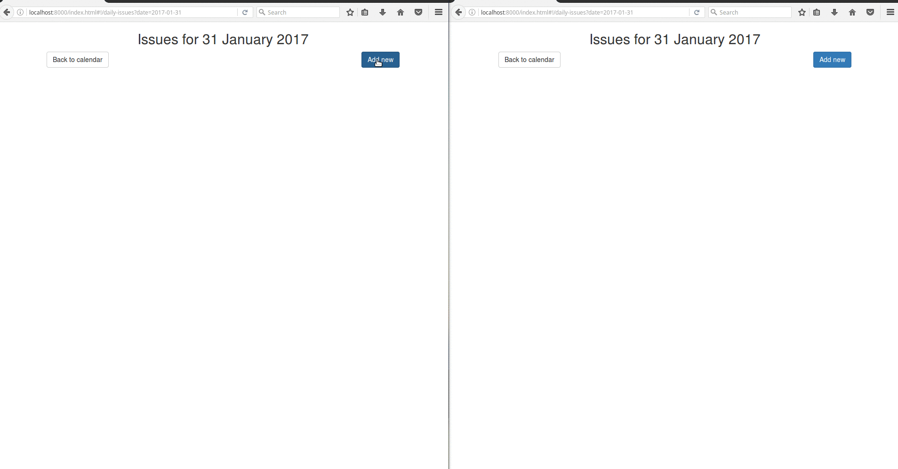

# Akka CQRS activator 

### Issue tracking demo application which shows implementation of event sourcing and CQRS with Akka

#### Technical requirements:

- Scala 2.12
- docker-compose version 1.8
- SBT
- NodeJS

#### Up and run:

- In root directory execute command: `docker-compose up -d` to start Cassandra
- In `src/main/resources/web` directory execute command: `npm install` to download required AngularJS dependencies
- Then execute command: `sbt run` or enter `sbt` console and execute `reStart` command to start server 
  (to stop server, type `reStop` and hit enter within the same `sbt` session).
  You should be able to access application at: http://localhost:8000 .  

### General concept:

#### Data store
 
Cassandra is being used as an event store and also as a "read side" data store. Normally, event store
and "read side" data store should be separated.

#### Write side

On the write side, Akka Persistent FSM actor is being used to store current state and to define behavior.
In our case - IssueRepository.
IssueRepositoryManager is being used to manage creation of IssueRepository actors. 
Each time when new issue is being created, new IssueRepository actor is being created with unique id. Therefore,
one actor per issue. The unique id is composed from time UUID and date (which is date of creation).
If the actor is not existing in the context of IssueRepositoryManager, then the actor is being created as a new one, or recovered 
by provided id. In case of recovery, events will be replayed and actor will be recovered to its
latest state. 

With FSM mechanism, we're preventing creation of two same issues or undesired behaviors. Such as: 
Deleting an issue before it's created, closing an issue which is deleted, updating an issue with is deleted etc.

Eventually, actor will pass through four states. Idle, IssueCreatedState, IssueClosedState 
and IssueDeletedState.

Each IssueRepository actor is being persisted with common tag - "issue-tag". Since id is not common, we will use
Akka Persistence Query to subscribe to events by a common tag.

#### Read side

On the read side, IssueVew actor is being used to poll Cassandra event store and to subscribe on stream of
events. Events are sent to IssueVew itself, their data is being processed, published to the DistributedPubSub mediator
and then used in execution of CQL statements against Cassandra read side data store. 
Other tasks of IssueVew actor are to query Cassandra database and to create read side keyspace and table.

#### Http API

In this case, we're using Akka HTTP to expose our ES & CQRS implementation to the "outer world".
HttpApi actor will start Akka HTTP server with few routes for: 

- Creating, updating, closing and deleting issues
- Querying database (obtaining all issues for specific date and issue by date and id)
- Event stream

In concept of CQRS write and read side are asynchronous. Therefore, we'll always face eventual consistency issue.
Which simply means: When written, data will not be immediately available for reading. In this example, we solved
this issue by publishing event to the DistributedPubSub mediator when it reaches its read side, then the issue is being 
published via event stream as a server sent event. Therefore, a frontend application can subscribe on this event
stream and live update its UI.

#### Frontend

Client side rendering with AngularJS.

Influenced by: [Reactive Flows](https://github.com/hseeberger/reactive-flows)
